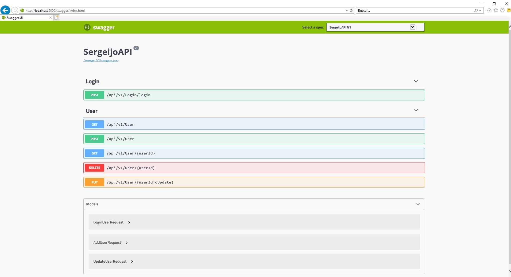

# SergeijoAPI
 DotNet Core API example built for INNOCV.

## Setup
Needs "Sql Server Express LocalDB" (If using Visual Studio install it under Individual Components in the Visual Studio installer or install separately using [this link](https://docs.microsoft.com/en-us/sql/database-engine/configure-windows/sql-server-2016-express-localdb?view=sql-server-2017).
- Apply database migrations to create the db:
	- *Visual Studio:* Open NuGet package console > Select project <code>Web.Api.Infrastructure</code> > Run commands **Add-Migration SergeijoAPI** and **Update-Database**.
  
  - *Visual Studio Code:* From a command line within the <code>Web.Api.Infrastructure</code> project folder use the dotnet CLI to run **dotnet ef database update**.

## Visual Studio
Simply open the solution file <code>SergeijoAPI.sln</code> and build/run.

## Visual Studio Code
Open the <code>src</code> folder and <code>F5</code> to build/run.

## Others
- GET Endpoint which returns all users, display better in the browser than in Swagger.
- Added field password in user model to have a more realistic API. Also added Login Endpoint.

 
